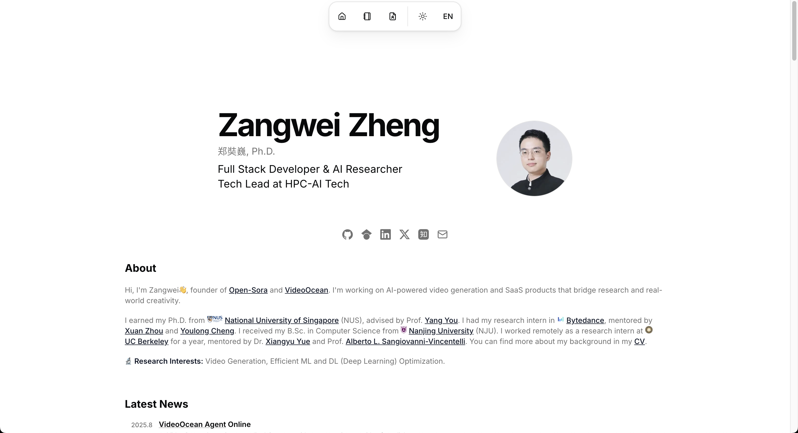

# Portfolio with Blog Template for Next.js 16 with App Router, Tailwind CSS 4, TypeScript

[](https://vercel.com/new/clone?repository-url=https%3A%2F%2Fgithub.com%2Fzhengzangw%2Fnextjs-portfolio-blog-research)

[](https://www.zangwei.dev/)

[Documentation →](https://www.zangwei.dev/open-source/nextjs-portfolio-blog-research/docs)

## Demo

- This repo on Vercel: [https://nextjs-portfolio-blog-research.vercel.app/](https://nextjs-portfolio-blog-research.vercel.app/)
- My portfolio: [zangwei.dev](https://www.zangwei.dev/)

## Features

A modern portfolio website with an integrated blog, supporting seamless AI-assisted coding for easy and highly flexible customization.

- ⚙️ **Quick setup:** Get started in minutes by editing the [single config file](/src/data.tsx).
- 📰 **Rich portfolio:** Showcase news, projects, experiences, and more.
- 📝 **Blog support:** Write effortlessly with Markdown in the [content/](./content) directory.
- 🌍 **Internationalization:** Out-of-the-box I18n for English & Chinese, easily extendable to other languages.
- 🌗 **Light & dark mode:** Instantly toggle color themes for the perfect look.
- 🧭 **Intuitive navigation:** Clean navbar, stylish footer, and simple language switching.
- 🌐 **Social integration:** Plenty of modern social media icons to connect everywhere.
- 🤖 **AI-assisted coding:** Seamless with [Cursor](https://www.cursor.com/) and [Cursor Rules](./.cursor).
- 📚 **Detailed docs:** Start fast & customize deep with [full documentation](https://docs-nextjs-portfolio-blog-research.zangwei.dev/).

**Built with cutting-edge tech:**

- ⚡ **Next.js 16:** Powered by the new App Router for flexibility & speed.
- 🔥 **TypeScript:** Full type-checking and safety.
- 💎 **Tailwind CSS 4:** Elegant, modern styling out of the box.
- ✅ **Strict Mode:** Takes advantage of TypeScript strictness and React 19 best practices.
- 💅 **UI magic:** Beautiful components via [shadcn/ui](https://ui.shadcn.com/) & [magic ui](https://www.magicui.com/).
- 🎬 **Smooth animation:** Powered by [Framer Motion](https://motion.dev/).
- 🚀 **Vercel ready:** Deploy in seconds with global fast hosting.
- 📱 **Responsive design:** Looks stunning on all devices.
- 🤖 **SEO optimized:** Includes metadata, JSON-LD, and Open Graph tags for top rankings.
- 🗺️ **Sitemap & robots:** SEO and crawling handled automatically.
- 💯 **Lighthouse perfection:** Tuned for top performance and best practices.
- 📊 **Analytics ready:** Connect Google Analytics 4, Google Tag Manager, and Google Search Console for powerful insights.
- 💖 **Prettier:** Effortless code formatting.
- 📏 **ESLint:** Linting for code quality and consistency.
- 🏗️ **Inspired by:** [dillionverma/portfolio](https://github.com/dillionverma/portfolio)
- 🔒 **Security:** Follows best practices for security and privacy.

## Getting Started 🚀

Spin up your own portfolio site in **minutes**!

### 1. Clone & install

```bash
git clone https://github.com/zhengzangw/nextjs-portfolio-blog-research
cd nextjs-portfolio-blog-research
pnpm install    # or: npm install | yarn install
```

### 2. Launch the dev server

```bash
pnpm dev        # or: npm run dev | yarn dev
```

Visit [`http://localhost:3000`](http://localhost:3000) to view your site.

### 3. Customize your portfolio

- Edit your main info in [`/src/data/site.tsx`](/src/data/site.tsx)
- Edit all interface text & profile sections in [`/src/i18n/messages`](/src/i18n/messages)
- Add blog posts in [`content/blog`](./content/blog) as Markdown or MDX files

The repo includes example portfolio data and blog posts so you'll see real content right away.

---

### 🚀 Deploy to Vercel Instantly

Click  
[](https://vercel.com/new/clone?repository-url=https%3A%2F%2Fgithub.com%2Fzhengzangw%2Fnextjs-portfolio-blog-research)  
Your portfolio will be live in minutes! No config needed. Vercel’s generous free plan is perfect for personal and demo sites.

---

Find more details and advanced guides in the [Documentation](https://www.zangwei.dev/open-source/nextjs-portfolio-blog-research/docs).
